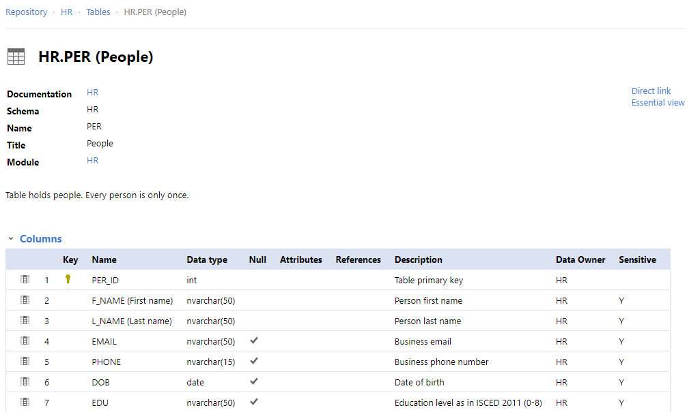
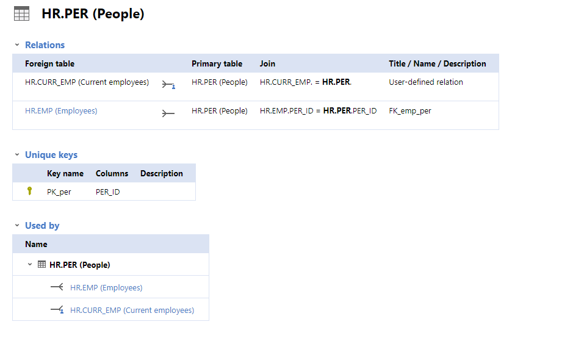

# Visão geral da demanda
<a href="#top">(inicio)</a>

## Objeto:

Desenvolvimento das aplicações para otimização do processo de abertura e publicação de dados que contemple:
 
- Programa de linha de comando para geração de site HTML estático para visualização dos metadados constantes de um data package

- Customização do CKAN para visualização dos metadados de conjuntos de dados e seus recursos que foram documentados como data packages

## Objetivo

Permitir a visualização em HTML da documentação de um conjunto de dados realizada com o padrão de metadados Frictionless Data. A visualização deve ser possível:

    i. durante o processo de produção da documentação pelos publicadores de dados, 

    ii. após a catalogação do conjunto de dados na solução de catálogo de dados utilizada no Portal de Dados Abertos de Minas Gerais, o CKAN.

  
# Motivação / contexto da demanda

 
## Obrigações legais e Competência Institucional

[A Lei Federal nº 12.527, de 18 de novembro 2011](http://www.planalto.gov.br/ccivil_03/_ato2011-2014/2011/lei/l12527.htm), conhecida como Lei de Acesso à Informação (LAI), regulou o acesso a informações previsto na Constituição Federal de 1988. Esse acesso à divulgação espontânea de informações de interesse coletivo, produzidas ou custodiadas pelos órgãos e entidades da Administração Pública, é conhecido por Transparência Ativa. No âmbito do Poder Executivo Estadual de Minas Gerais, a transparência ativa foi regulamentada por meio do [Decreto nº 45.969, de 24 de maio de 2012](https://www.almg.gov.br/consulte/legislacao/completa/completa.html?tipo=DEC&num=45969&comp=&ano=2012). 

Os dispositivos dessas normas que se relacionam-se às diretrizes do processo de abertura e publicação de dados são:

* presença de ferramenta de pesquisa de conteúdo que permita o acesso à informação de forma objetiva, transparente, clara e em linguagem de fácil compreensão;

* possibilidade de gravação de relatório em diversos formatos eletrônicos, inclusive abertos e não proprietários, tais como planilha e texto, de modo a facilitar a análise da informação;

* possibilidade de acesso automatizado por sistemas externos em formatos abertos, estruturados e legíveis por máquina;

* divulgação das especificações básicas dos formatos utilizados para estruturação da informação;

* garantia a autenticidade e a integridade das informações disponíveis para acesso;

* atualização das informações disponíveis para acesso;

Tais diretrizes foram replicadas, atualmente, na [Lei 14.129 (Lei do Governo Digital)](https://www.in.gov.br/en/web/dou/-/lei-n-14.129-de-29-de-marco-de-2021-311282132), bem como também integram a [Resolução CGE n° 020, de 06/08/2014, da Controladoria Geral do Estado](http://pesquisalegislativa.mg.gov.br/LegislacaoCompleta.aspx?cod=171158&marc=Dados%20abertos) que estabelece conceitos e diretrizes, no âmbito da Administração direta, autárquica e fundacional do Poder Executivo Estadual, em matéria de dados abertos governamentais. Essa Resolução postula, ainda, que os dados abertos **devem permitir sua livre reutilização, consumo ou cruzamento em aplicações digitais desenvolvidas pela sociedade**. 

A estrutura administrativa responsável por promover e induzir a aplicação de tais diretrizes no âmbito do poder Executivo do Estado de Minas Gerais é a Diretoria Central de Transparência Ativa (DCTA). Essa pasta, à luz do [Decreto estadual 47.774/2019](https://www.almg.gov.br/consulte/legislacao/completa/completa.html?tipo=DEC&num=47774&comp=&ano=2019), em seu artigo 44, tem como competência implementar as ações de transparência ativa do Poder Executivo, com atribuições de conceber e implementar um processo para abrir, editar, documentar, publicar e atualizar dados:

> **III – fomentar a disponibilização de informações públicas em formato aberto no Portal da Transparência e nos sítios eletrônicos dos órgãos e entidades do Poder Executivo**;
>
> **IV – planejar e coordenar o desenvolvimento das regras de negócio para as ferramentas e sistemas visando a promoção da transparência ativa no âmbito do Poder Executivo**;
>
> **V – orientar os agentes públicos quanto a disponibilização de informações nos sítios institucionais e nos demais assuntos pertinentes a sua área de atuação.**

## Objetivos Estratégicos

Existe um compromisso institucional de abertura de dados, representado no indicador de incremento do PERCENTUAL DAS CONSULTAS DO PORTAL DA TRANSPARENCIA DIVULGADAS NO PORTAL DE DADOS ABERTOS DE MANEIRA TEMPESTIVA (%). Esse indicador possui metas para o horizonte 2021-2024 e foi pactuado no [Plano Plurianual de Ação Governamental](https://drive.google.com/drive/folders/1FiwRVScro1xL16flbq8mS91o7dpeTw-Z)(programa 032) e no [Planejamento Estratégico da CGE](https://cge.mg.gov.br/download/category/35-arquivos-diversos?download=426:planejamento-estrategico-2020-2023). A [Estrategia de Tecnologia de Informação e Comunicação (TIC)](http://planejamento.mg.gov.br/sites/default/files/documentos/gestao-governamental/gestao-de-ti/estrategia_2021_-_consulta_gestores_de_tic_0.pdf) do Estado também prevê uma diretriz de implantar 10 novos conjuntos de dados no Portal de Dados Abertos.

A documentação de um conjunto de dados, a partir de ferramentas que propiciem a edição e visualização de metadados, auxilia o cumprimento dos objetivos estratégicos, pois pretende a facilitação do processo de abertura e publicação de dados e, dessa forma, a adesão de mais custodiantes de dados. Do ponto de vista normativo, permite o cumprimento das diretrizes de _acesso automatizado por sistemas externos em formatos abertos, estruturados e legíveis por máquina_ e _divulgação das especificações básicas dos formatos utilizados para estruturação da informação_ e _permitir sua livre reutilização, consumo ou cruzamento em aplicações digitais desenvolvidas pela sociedade_. A figura seguinte ilustra o ciclo almejado:

Entretanto, com a configuração básica da plataforma utilizada, o CKAN, há a limitações a serem superadas. Ele não permite visualização intermediária durante o processo de elaboração ou edição dos metadados (para circulação interna entre custodiante e gestor do Portal de Dados, antes da publicação). Também não possibilita elaboração de artefatos como diagrama de relacionamentos entre tabelas ou explicitação de restrições de dados. É necessário, enfim, aprimorar a plataforma

# Especificação
<a href="#top">(inicio)</a>

As necessidades de negócio, no processo de documentação de um conjunto de dados, que devem ser supridas com os itens especificados são:

- representação visual dos metadados -> arquitetura e identidade visual

- metadados table schema -> metadados tabular data resource

- diagramas estáticos -> diagramas ER

- diagramas interativos -> diagramas ER

- metadados de validação -> metadados de validação

- metadados recursos vs schema -> metadados table schema

- metadados estatísticas descritivas -> metadados estatísticas descritivas

- exportar para PDF

- exportar diagramas para SVG

## Itens

### Documentação legível por humanos: 

Implementação de solução e capacitação para que custodiantes de dados e gestores do Portal de Dados Abertos criem e controlem as alterações de versão dos dicionários de dados. Essas versões devem ter visualizações estáticas para cada (de forma análoga aos pull requests do github), mas sem necessidade de publicação, e somente com circulação restrita interna entre gestores do portal de Dados Abertos e custodiantes de dados.

Essa solução deve conter ou permitir:

1. visualização gráfica/diagrama RD (entidade relacionamento) que mostre recursos que têm relação entre si

    

1. navegação entre diagrama e dicionário (tabela), que possibilite a operabilidade de, em se clicando na tabela, o foco para o local do diagrama seja trazido para a visualização; (feição do dicionário de dados tem de responder a interações no diagrama)

    

1. visualização do dicionário tem de mostrar as restrições de cada variável (chave primária/secundária, etc) - essas funcionalidades deverão estar à disposição no momento da elaboração do datapackage (outras ferramentas existem quando ele está pronto, p. ex. = https://github.com/frictionlessdata/ckanext-validation)

    

    

1. um gerador de site estático: as funcionalidades da solução a ser implementada devem acontecer num formato de site completo, com design, sem nenhum componente de servidor que o sustente

1. visualização do dicionário tem de ser uma extensão no CKAN

    
 
### Documentação legível por máquina: 

Implementação de solução e capacitação para que custodiantes de dados realizem a confecção do documento descritivo dos metadados do conjunto de dados (datapackage.json).

## Obrigações/requisitos
 
A contratação envolverá:

1. apresentação de alternativas de solução para os problemas apresentados, diante dos requisitos indicados
1. discussão com equipe gestora do Portal
1. implementação das soluções aprovadas de forma que a equipe da DCTA possa conduzí-las de forma independente do contratante
1. elaboração de tutorial auto-instrucional da contratante para postagem no Portal de Dados Abertos e consumo dos órgãos/entidades custodiantes 

# Dependências / Integrações

- Ambiente Tecnológico (se necessário indicação)

    - (Python, Jinja2 templates, Bootstrap, jQuery, TypeScript, React, Next.js, Geradores de Site Estático)
    - https://docs.ckan.org/en/2.8/theming/index.html
    - https://github.com/frictionlessdata/components
    - https://github.com/datopian/portal.js

- permissões de rede PRODEMGE/CGE

- [Desenvolvimento de sistemas](http://www.planejamento.mg.gov.br/pagina/gestao-governamental/gestao-de-ti/desenvolvimento-de-sistemas): diretrizes e exemplos para o estabelecimento de controles com base em padrões de mercado

## Enquadramento nos requisitos e premissas das normas mais recentes

### Lei Geral de Proteção de Dados

### Decreto 10.046/2019

(dispõe sobre a governança no compartilhamento de dados no âmbito da ADM Federal)

> Seção II: Do compartilhamento amplo de dados 
>
> Art. 11.  O compartilhamento amplo de dados dispensa autorização prévia pelo gestor de dados e será realizado pelos canais existentes para dados abertos e para transparência ativa, na forma da legislação.
>
> § 1º  Na hipótese de o dado de compartilhamento amplo de que trata o caput não estar disponível em formato aberto, o solicitante de dados poderá requerer sua abertura junto ao gestor de dados.
>
> (...)
>
> § 3º  A Controladoria-Geral da União e o Comitê Interministerial de Governança, de que trata o Decreto nº 9.203, de 22 de novembro de 2017, poderão recomendar, quando econômica e operacionalmente viável, a abertura dos dados de compartilhamento amplo em transparência ativa.
>
> § 4º  **Os solicitantes e recebedores de dados adotarão medidas para manter a integridade e a autenticidade das informações recebidas**.
>
> § 5º  **Os dados de compartilhamento amplo serão catalogados no Portal Brasileiro de Dados Abertos em formato aberto**.

OBS.: minuta de decreto análogo está sendo discutido pelas instâncias estaduais de governança, com alta probabilidade de replicação das definições sobre as categorias de compartilhamento de dados

# Exemplos / Pesquisa
<a href="#top">(inicio)</a>

* [Schema Collaboration](https://frictionlessdata.io/blog/2021/01/18/schema-collaboration/#what-problem-does-schema-collaboration-solve)

    - usa a interface do datapackage creator como 'google docs' para edição colabotativa de um mesmo datapackage.json; necessita instalação de outro app (Docker); é uma ferramenta recente (criada em 2020, a referência do blog é de janeiro de 2021); faltariam os itens de especificação 1.1, 1.2 e 1.3

    - [documentação](https://github.com/frictionlessdata/schema-collaboration/blob/master/documentation/User.md#schema-collaboration)

    > The solution in this tool fund was to build a system that uses Data Package Creator to enable data managers and researchers to create and share dataset schemas, edit them, post messages and export the schemas in different formats (text, Markdown, PDF). To encourage collaboration within a project multiple researchers can work on the same schema. Being able to view the description in human-readable formats makes it easier to spot mistakes and to integrate with third-party data repositories.
    >
    > From a data manager’s perspective the tool allows them to keep tabs on the datasets being managed and their progress. It prevents details getting lost in emails and hopefully provides a nicer interface to encourage better collaboration.
    >
    > In other words: think of a very simplified “Google Docs” specialised for data packages

* [Dataedo](https://dataedo.com/samples/html2/enterprise/#/doc/m99/hr/modules/hr):
    
    - Contém diagramas de relacionamento; 
     
    - permitem navegar para as tabelas de dicionário de dados a partir dos hiperlinks contidos no diagrama;
    
    - para cada tabela, além do dicionário, apresenta as chaves primária e estrangeira e os relacionamentos possíveis entre tabelas (além do método de chamada para cruzá-las)

    - exemplo: https://dataedo.com/samples/html2/enterprise/#/doc/m103t3733/procurement/tables/pur-shipment-lines

* [data.world](https://data.world/kgarrett/covid-19-open-research-dataset)

    - guia para edição de metadados: https://help.data.world/hc/en-us/articles/1260802115269-Custom-metadata

* [kaggle](https://www.kaggle.com/ajaypalsinghlo/world-happiness-report-2021)

* [dbt](https://www.getdbt.com/mrr-playbook/#!/overview)

# Dúvidas
<a href="#top">(inicio)</a>
