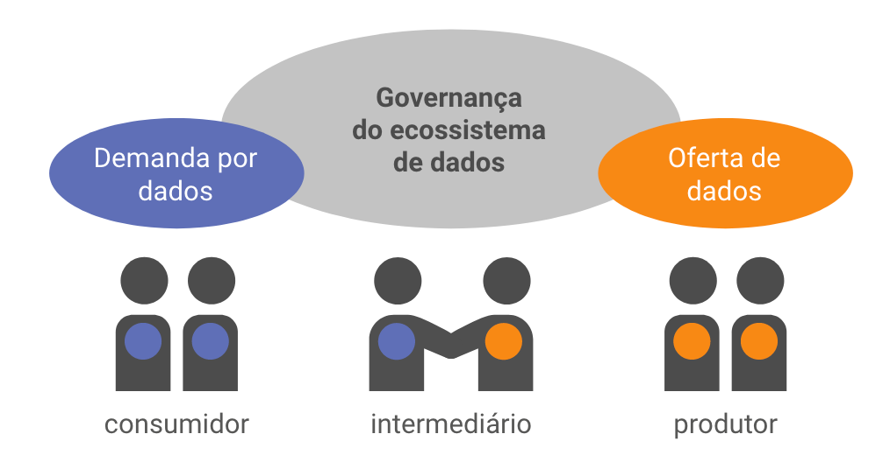

Esse documento é um registro das necessidades do cliente[^1] identificadas para fins das intervenções no [Portal de Dados Abertos](https://www.dados.mg.gov.br) (PdA) no âmbito do subprojeto “Melhorias no Portal de Transparência e de Dados Abertos do Estado de Minas Gerais” que consta do projeto “Fortalecimento e reestruturação tecnológica da Controladoria Geral do Estado (CGE)”.

Atualmente os dados categorizado em nível de compartilhamento amplo no âmbito da Administração Pública direta, autárquica e fundacional do Poder Executivo Estadual devem obrigatoriamente ser catalogados em formato aberto no PdA por força do [Decreto nº 48.383/2022](legislacao.md#decreto-48383-de-18032022) (art. 27, § 3º).

[Dados de compartilhamento amplo são dados públicos que não estão sujeitos a nenhuma restrição de acesso, cuja divulgação deve ser pública e garantida a qualquer interessado, na forma da legislação.]{.aside}

Esse dispositivo reforçou a intenção do PdA, lançado em 2020[^2], de ser _ponto de referência para busca e acesso a dados públicos_ sobre assuntos de interesse da sociedade, como saúde, educação, segurança pública, assistência social, esportes, turismo. 
Em outras palavras, o PdA visa endereçar as questões de _findability_ e _discoverability_ dos dados.

[^2]: Em 2020, a seção de dados abertos do Portal da Transparência foi sucedida pelo novo PdA. Essa seção tinha como escopo dar publicidade a informações sobre os processos de gestão de finanças públicas dos órgãos e entidades do Poder Executivo. 

{#fig-ecossistema-dados}

Como forma de reduzir os custos de transação ao longo do ciclo de vida dos dados abertos, a CGE adotou[^regulamentacao-adocao-padrao] o padrão de metadados [_Frictionless_](https://frictionlessdata.io/) para documentar conjuntos de dados. 
Dados documentados de acordo com esse padrão são chamados de _data packages_.
As necessidades deste projeto estão relacionadas as etapas de produção, publicação, visualização e acesso de [_data packages_](glossario.md#data-package) por parte dos usuários (produtores e consumidores) do [Portal de Dados Abertos](https://dados.mg.gov.br/) (PdA).

[^1]: Em outras palavras, esse documento representa o backlog do produto, entregável da Ideação - etapa que tem como objetivo capturar e priorizar necessidades, olhando-as com maior clareza e profundidade, imergindo no problema para compreender o contexto e a perspectiva do cliente - que de acordo com o item 1.1.6.2 do Termo de Referência deve ser realizada pela CONTRATANTE. 

[^regulamentacao-adocao-padrao]: O Comitê de Tecnologia da Informação e Comunicação do Governo do Estado de Minas Gerais – Cetic, regulamentado pelo Decreto nº 47.974, de 5 de junho de 2020, em conjunto com a Controladoria-Geral do Estado – CGE, poderá estabelecer normas complementares relacionadas com a elaboração do Plano de Dados Abertos e do inventário de bases de dados, bem como relacionadas com a proteção de informações pessoais na publicação de bases de dados abertos nos termos deste decreto.

## Motivação / contexto da demanda

No [Planejamento Estratégico 2020-2023 da CGE](https://cge.mg.gov.br/phocadownload/Planejamento%20Estratgico%202020-2023%20-%20final.pdf#page=30) as seguintes ações foram inseridas no Eixo _TRANSPARÊNCIA E FORTALECIMENTO DA INTEGRIDADE_ em relação a temática dados abertos:

- Desenvolvimento de serviço/aplicativo para automação da carga de dados no Portal de Dados Abertos
- Condução de avaliações de qualidade dos dados publicados via modelos de maturidade de publicação de dados abertos
- Promoção de iniciativas de engajamento e criação de "data literacy" entre usuários (incluindo servidores públicos)

Essas ações indicam um compromisso com a adoção de um processo de abertura de dados automatizado e que possua controle de qualidade dos dados publicados.

O contexto detalhado, incluindo discussão das escolhas tecnológicas, estão disponíveis [neste link](motivacao-contexto.md).

## Necessidades

Uma descrição detalhada de cada necessidade está disponível via _menu lateral_, essa seção visa oferecer uma visão de alto nível sobre cada uma das macroetapas do ciclo de vida idealizado para os dados abertos no EMG.

### Produção

A macroetapa de Produção consiste nas atividades necessárias para que um _data package_ válido seja produzido. 
Ela também inclui as atividades de incorporar alterações no _data package_.

- [DEVT Framework](https://framework.frictionlessdata.io/docs/guides/introduction/#user-stories)

### Publicação

### Acesso

### Uso

Essa demanda visa permitir a visualização em HTML da documentação de um conjunto de dados realizada com o padrão de metadados [Frictionless Data](https://specs.frictionlessdata.io/).

:::{.callout-note}
A recomendação Boas Práticas para Dados na Web da W3C recomenda em sua [boa prática 1](https://w3c.br/traducoes/DWBP-pt-br/#ProvideMetadata) que

> Fornecer metadados é um requisito fundamental na publicação de dados na Web, porque os publicadores de dados e os consumidores de dados podem não se conhecer mutuamente. __Portanto, é essencial fornecer informações que auxiliem pessoas e aplicações de computadores a compreenderem os dados__, assim como outros aspectos importantes que descrevam o conjunto de dados ou a distribuição.

No padrão de metadados _Frictionless Data_, o fornecimento de metadados legíveis por máquina é feita no arquivo `datapackage.json`. No entanto, o fornecimento de metadados legíveis por pessoas não possui uma opção clara no [ecossistema de ferramentas atual](https://frictionlessdata.io/).
:::

A visualização deve ser possível durante o processo de produção da documentação pelos publicadores de dados, bem como após a catalogação do conjunto de dados na solução de catálogo de dados utilizada em Minas Gerais, o [CKAN](https://ckan.org/).

Para atender esses dois casos de uso devem ser desenvolvidos:

- Programa de linha de comando para geração de site HTML estático para visualização dos metadados constantes de um _data package_ 
- Extensão do CKAN para customização das páginas de visualização dos metadados do conjuntos de dados e seus recursos que foram documentados como _data packages_

A visualização nos dois casos deve, na medida do possível, ser a mesma.

:::{.callout-important}
Na etapa de análise comparativa de soluções deve ser especialmente considerado se os esforços de desenvolvimento serão para 

- utilização de uma solução pronta, ou
- construção de uma solução totalmente customizada, ou 
- adaptação de solução de código aberto existente, com eventual contribuição para o projeto original mediante alinhamento de direção com os responsáveis.
:::

A visualização em uma página HTML dos metadados constantes do `datapackage.json` visa sintetizar, inclusive com utilização de diagramas, os metadados padronizados constantes de [data packages tabulares](https://frictionlessdata.io/data-package/#the-data-package-suite-of-specifications), especialmente os constantes da especificação [table schema](https://specs.frictionlessdata.io/table-schema/#language).

Nesse caso, o trabalho de _design_ de interação e interface para elaboração de uma identidade visual atrativa, mas, principalmente, para representação de todos os metadados presentes nas especificações _Frictionless_ em uma única página HTML será reutilizado tanto no gerador de site estático quando na extensão do CKAN.

A possibilidade de reuso de componentes entre essas duas entregas faz parte das definições arquiteturais.
