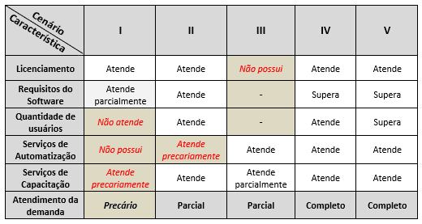
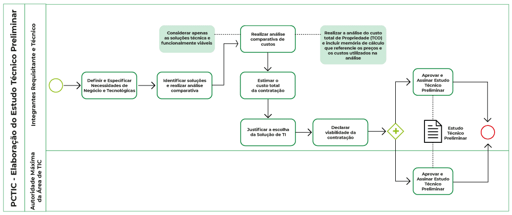

# IN SGD/ME 1/2019

### Alinhamento com Planejamento Estratégico (art. 6)

- Plano Diretor de TIC do órgão/entidade;

- previstas no Plano Anual de Contratações;

- alinhadas à Política de Governança Digital;

- integradas à Plataforma de Cidadania Digital, quando tiverem por objetivo a oferta digital de serviços públicos;

- padrões de TIC do Governo Federal

### Equipe de Planejamento da Contratação (EPC) - art. 2º, IV

integrante técnico (DTI) + integrante administrativo (SPGF) + itegrante requisitante

- esses 3 papeis não podem ser acumulados pelo mesmo servidor

A instituição da EPC é um ato administrativo, geralmente Portaria

## Artefatos

### 1. Documento de Oficialização da Demanda (DOD): 

1.1. necessidade da contratação

1.2. explicitação da moticação e dos resultados a serem alcançados com a contratação 

1.3. indicação da fonte dos recursos para contratação

1.4. indicação do integrante requisitante para composição da Equipe de Planejamento da Contratação

* Vide [formulário do DOC](https://github.com/dados-mg/projeto-contrato/blob/main/materiais-guias-referencia/1-artefatos-2019-documento-de-oficializacao-da-demanda-v1-0.odt) 

### 2. Estudo Técnico Preliminar da Contratação (ETPC): ###

Documento que descreve as análises realizadas em relação às condições da contratação em termos de necessidades, requisitos, alternativas, escolhas, resultados pretendidos e demais características, e que demonstra a viabilidade técnica e econômica da contratação.

As atividades desta etapa:

2.1. Definir e especificar [necessidades de negócio]() e [tecnológicas]();

2.2. Identificar soluções e realizar análise comparativa 

;

2.3. Realizar análise comparativa de custos (principalmente via consultas ao painel de preços do governo federal/portal de compras MG; e contratações similares de outros entes públicos);

2.4. Estimar o custo total da contratação;

2.5. Justificar escolha da solução de TI

2.6. Declarar viabilidade de contratação

2.7. Aprovar e assinar Estudo Técnico Preliminar

* Fluxo de elaboração

No ETP devemos ter atenção a requisitos que influenciam no valor, no resultado e/ou no desempenho do objeto, tais como:

- Equipamentos necessários ao funcionamento da solução.     

- Serviços que devem ser executados (mesmo em aquisições de bens, pode haver serviços de instalação ou configuração envolvidos).     

- Produtos que devem ser entregues.       

- Padrões que a contratação deve seguir ou atender.     

- Público alvo e pessoal necessário para operar a solução.     

- Competências do pessoal que vai executar os possíveis serviços ou responsabilizar-se pelos produtos.       

- Necessidade de realizar capacitações.       

- Demandas semelhantes de outras áreas que não a requisitante, mas envolvidas no processo em que a solução vai intervir, ou que podem necessitar da mesma solução.

#### Requisitos de contratação

__a) NECESSIDADES DE NEGÓCIO: que cabem ao REQUISITANTE:__

1. de negócio;

2. de capacitação;

3. legais;

4. de manutenção;

5. temporais;

6. de segurança

7. sociais, ambientais e culturais

__b) NECESSIDADES TECNOLÓGICAS: que cabem ao INTEGRANTE TÉCNICO (~DTI)__

1. de arquitetura tecnológica, composta de hardware, software, padrões de interoperabilidade, linguagens de programação, interfaces, dentre outros;

2. de projeto e de implementação, que estabelecem o processo de desenvolvimento de software, técnicas, métodos, forma de gestão, de documentação, dentre outros;

3. de implantação, que definem o processo de disponibilização da solução em ambiente de produção, dentre outros;

4. de garantia e manutenção, que definem a forma como será conduzida a manutenção e a comunicação entre as partes envolvidas;

5. de capacitação, que definem o ambiente tecnológico dos treinamentos a serem ministrados, os perfis dos instrutores, dentre outros;

6. de experiência profissional da equipe que executará os serviços relacionados à solução de TIC, que definem a natureza da experiência profissional exigida e as respectivas formas de comprovação dessa experiência, dentre outros;

7. de formação da equipe que projetará, implementará e implantará a solução de TIC, que definem cursos acadêmicos e técnicos, formas de comprovação dessa formação, dentre outros;

8. de metodologia de trabalho;

9. de segurança da informação

### 3. Termo de Referência

### Gestão de riscos em todas as 3 macroetapas

riscos relacionados à contratação, tanto aos relativos ao processo de planejamento propriamente dito quanto àqueles inerentes ao objeto a ser contratado, bem como aos futuros riscos das fases subsequentes, isto é: Seleção do Fornecedor de TIC (SFTIC) e Gestão do Contrato de TIC (GCTIC). 
à medida que avançamos no PCTIC, vamos compilando os riscos observados ao longo das atividades e tomando as ações e decisões de tratamento de riscos adequadas na fase do PCTIC, visando aumentar a chance de sucesso da nossa contratação. Também vamos modelando o objeto de forma a mitigar (reduzir) riscos relativos às fases seguintes, que com certeza vamos identificar. Tudo isso é incorporado a um artefato chamado Mapa de Gerenciamento de Riscos (MGR).

ref seção IV, Capítulo III da IN SGD/ME nº 1/2019

