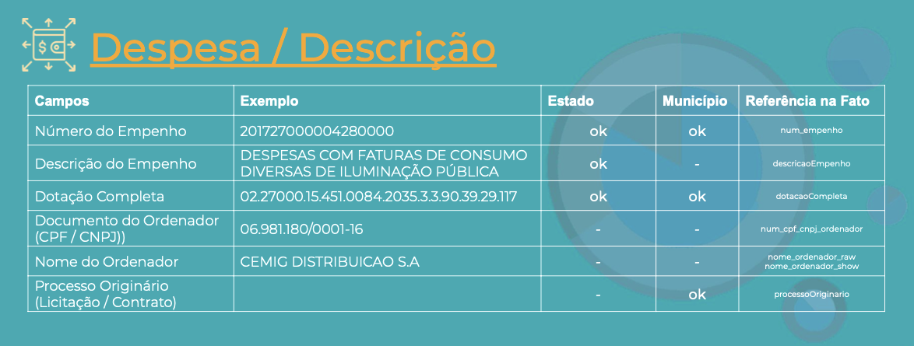

- Full-text fuzzy search no dicionário de dados
- Renderização do markdown da propriedade `description`
- Símbolo para representação de chave primária, chave estrangeira, unique e required
- enum com detalhes adicionais
- Exemplos de dados (sample values; data preview)
- Flexibilidade para campos ad-hoc (estado e município)
- Footnotes and annotations

## Examples

- https://github.com/fjuniorr/age7-data-dictionary

- [dbt docs](https://www.getdbt.com/mrr-playbook/#!/model/model.acme.customer_churn_month)

    - Expandir detalhes de coluna (More...) ($tabela)

- [dataedo](https://dataedo.com/samples/html/Data_warehouse/index.html)

    - Chave estrangeira clicavel ($tabela)
    - Símbolo para representação de chave primária e estrangeira ($tabela)
    - Backlinks com chaves estrangeiras de outras tabelas ($tabela)

-  Modelo de Dados Projeto Lins (ModeloDados_Lins_v0.9_junho2020.pdf)

    Incluir coluna com exemplos dos valores

    